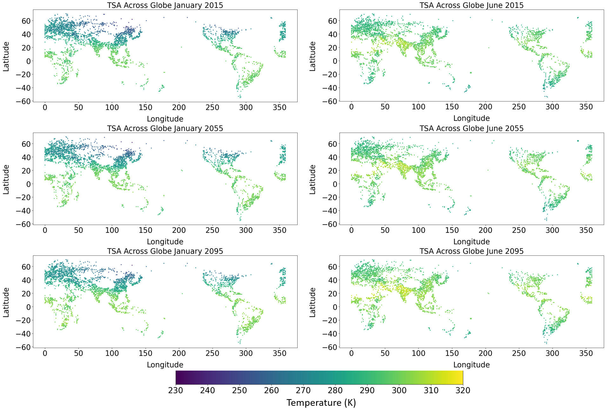
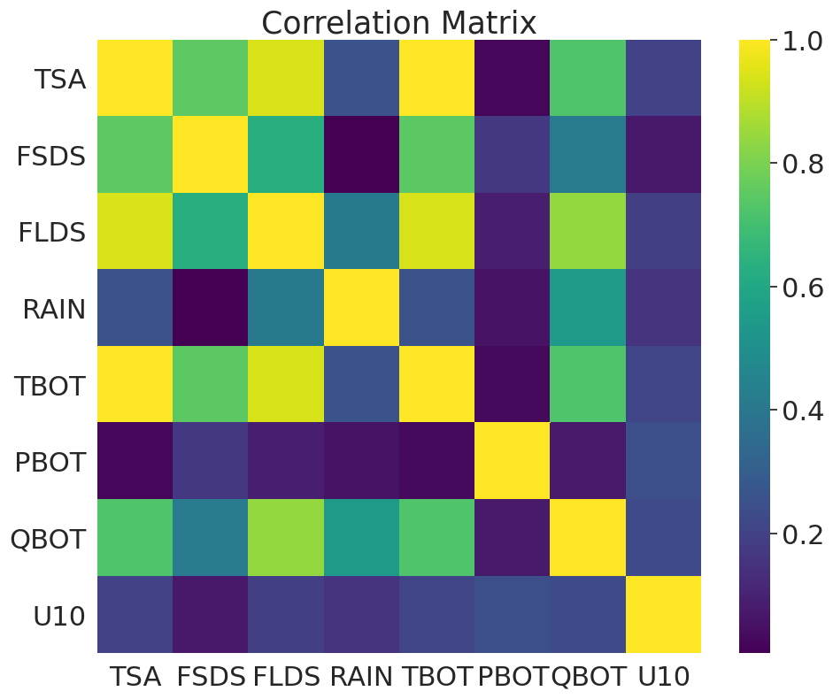

## III. Methods

#### A. Exploratory Data Analysis Findings
Exploratory data analysis was performed on the training set to understand the dataset as well as the key variables included and their associated patterns. We also wanted to identify relationships among variables, which we believe will help us choose the best predictors for our model.

The training dataset contains 486 columns and 392118 rows. It includes the monthly mean of each variable from 2015 to 2100, with one year selected per decade, totaling 108 months. The longitude resolution is 288 pixels, and the latitude resolution is 192 pixels. Only the populated land area is retained. Therefore, each row represents variables in each pixel for each time step. The large number of rows indicates that we have enough samples to train the model. For columns, in addition to the target variable (urban 2-m air temperature or “TSA”) that we want to predict, we still have 485 variables that could be used as inputs to the model. Among those, some are merely descriptive information which do not provide useful clues for predicting TSA, such as current day or nstep, so they can be safely excluded.  

We wanted to further narrow down the range of variables to use as inputs, which was done by identifying the correlation between potential independent variables and the target variable. It was found that variables that were highly correlated with TSA were also temperature variables, many of which were interdependent and would not add much value to the model due to multicollinearity. Those variables are listed below.

* TSA_ICE = 2m air temperature (ice land units only)
* TBOT = atmospheric air temperature
* TG_ICE = ground temperature (ice land units only)
* TV = vegetation temperature
* TSKIN = skin temperature
* THBOT = atmospheric air potential temperature
* TG = ground temperature
* TREFMNAV = daily minimum of average 2-m temperature
* TSL = temperature of near-surface soil layer
* TSOI_10CM = soil temperature in top 10cm of soil
* TREFMXAV = daily maximum of average 2-m temperature
* TH2OSFC = surface water temperature
* TBUILD = internal urban building air temperature
* WA = water in the unconfined aquifer
* ZBOT = atmospheric reference height
* Vcmx25Z = canopy profile of vcmax25
* TOPO_COL_ICE = column-level topographic height
* ZWT_PERCH = perched water table depth  

A full list of all variables considered in the model is available in the Appendix.

Therefore, when preparing data for our model we would need to filter the predictors to only include forcing variables. We also thought that adding interaction terms between multiple variables (e.g. feature crossings of spatial and time variables such as RAIN*month) in the model would be helpful, and this might be achieved by letting the model learn the relationships by itself without manually specifying them.  

The next step was to delve into some valuable variables by visualizing them both spatially and temporally to understand the range and distribution, as well as identify anomalous values.  

#### **1. TSA**

Since TSA is our target output, we focused much of our effort on analyzing it.  

Some NAN values of TSA from 2035-08 and 2035-09 were cleaned up. Time series plots of global monthly mean temperature in urban areas showed seasonal fluctuations. The highest TSA appeared in JJA every year, which might be because there are more urban areas in the northern hemisphere where summer is in JJA. The figure below shows the high and low temperature for each year in our time series, and the flat period in between represents the years where we do not have data (we have data for 1 out of every 10 years).

 

*Figure 1: time series plot of global monthly average TSA in urban areas* 
  
 
When these data are considered throughout the full timeline, there was an upward trend in the maximum, mean, and minimum annual temperature over the time range of projections. This climate change trend is something we would want to be able to capture in our model.

*Figure 2: maximum, mean and minimum annual temperature trend* 
    
 
The standard deviation of TSA over time was also assessed, which tended to be higher in DJF than in JJA, and the magnitude did not seem to change significantly. This suggested that the underlying drivers of TSA may remain steady, even as the overall average increases.

*Figure 3: time series plot of the standard deviation of global monthly average TSA in urban areas* 
   

We also examined these temperature data spatially to see how the data vary globally. As expected, the figure below shows the seasonal patterns between the northern and southern hemispheres, as well as higher temperatures near the equator. These spatial patterns of temperature in 2015, 2055 and 2095 remain similar but it is clear that warming is occurring. In particular, the Indian subcontinent appears to become warmer in the series of maps. It is also important to note that the majority of our data points are located in the northern hemisphere.

*Figure 4: Maps of TSA in January and June of 2015, 2055 and 2095* 
   

#### **2. Other temperature variables** 

We examined other temperature variables that were highly correlated with TSA to verify the hypothesis of multicollinearity. Variables explored included vegetation temperature (TV), surface water temperature (TH2OSFC), internal urban building air temperature (TBUILD).

Vegetation temperature and surface water temperature had a similar spatial distribution to TSA, demonstrating high multicollinearity. The internal building air temperature had a very different spatial distribution compared to the vegetation temperature, surface water temperature, and TSA. This was likely because it is not an atmospheric variable and is probably strongly influenced by human decision-making.

*Figure 5: Maps of TV, TH2OSFC and TBUILD in January of 2015* 
    

#### **3. Some atmospheric forcing variables**

Some atmospheric forcing variables were also worth exploring because they are inputs to every earth system model and provide a lot of information about TSA prediction, although they are not as correlated to TSA as other temperature variables. The variables chosen were according to Zhao et al (2020). The descriptions and units of these variables are listed below.

* FSDS (W/m^2): atmospheric incident solar radiation
* FLDS (W/m^2): atmospheric longwave radiation
* RAIN (mm/s): atmospheric rain, after rain/snow
* TBOT (K): atmospheric air temperature
* PBOT (Pa): atmospheric pressure at surface
* QBOT (kg/kg): atmospheric specific humidity
* U10 (m/s): 10-m wind

The correlation matrix showed that although these variables were not as highly correlated with TSA, they were still fairly correlated, especially for TBOT and FLDS.

*Figure 6: correlation matrix of TSA and atmospheric forcing variables* 
  

We compared the spatial pattern of these variables to that of TSA, taking January 2015 as an example. The patterns of TBOT, FSDS, FLDS and QBOT were similar to those of TSA, whose values were larger near the equator and decreased with the increase of latitude. Other variables (RAIN, PBOT, U10) did not have clear spatial patterns, which made sense since they were not related to geospatial attributes.

*Figure 7: Maps of TSA, TBOT, FSDS, FLDS, RAIN, PBOT, U10 and QBOT in January of 2015* 
 

Overall, we were able to gather useful information from the exploratory data analysis. The data quality was improved by identifying and removing outliers in the dataset. We learned how the temperature changed over the course of the century. We will try different combinations of variables with different algorithms to see how to achieve the best accuracy with the least amount of computing resources.

#### B. Preprocessing Data for Model

Based on the EDA, we gained some clarity about what type of preprocessing was necessary. For all of the models, NaN values for the target variable (TSA) were removed from the training set. However, the EDA also showed a set of major outliers in 2035 that were highly negative. While the initial instinct was to remove these values from the dataset, upon further inspection it was clear that these outliers were matched with outliers in other correlated temperature variables such as TG. These same patterns were observed in the independent variables of the test dataset, which implied that the same outliers likely appear in the target variable of the test set. Since all values in the test set need to be predicted, even the outliers, it is important to keep these anomalous values in the training set so that they are also reflected in the testing set. In the ideal world, all of these values would be removed from training and testing data but this is not possible since we could not edit the number of rows in the testing data used for the Kaggle competition.  

All models also included a step using sklearn’s “SimpleImputer” to fill missing values in the independent variables. The command filled missing values using the default, which is to use the mean of the column to fill the missing value. In addition, the training and testing data were normalized using the mean and standard of each of the variables.

The time variable in the original dataset is a string with all elements of the date included. For some of the models, we wanted to include time as one of the independent variables. Thus, time was converted to datetime and split into multiple columns for day, month, and year. Sine and cosine of these variables were included as variables in some models to represent the cyclical pattern where the last number of one set will be next to the first number of the next. For example, we want to represent December of one year (month 12) next to January of the next year (month 1).

Another important step that occurred in all of the models was to split the data into training and validation sets. Since the target variable values for the testing dataset are not available, this split is necessary to be able to test the accuracy of the models against a different dataset than the data used to train the model. There were two methods used for splitting the data. In some of the models, the data was split randomly. Alternatively, in some of the random forest models, a different splitting method was used. Since our data resembles a time series, although we were not using it as one, our data follows a cyclical pattern that is relatively consistent through the years. In this type of dataset, if a random set of points are used as the validation set, the pattern would still be evident. The model can easily fill in the gaps. In these cases, it is recommended to make a validation set that is a full section of the data because this will be a better test of the model’s ability to predict the target. Thus, the full data for 2085 and 2095 were used as the validation set in some cases.

#### C. Model Development

Choosing the appropriate model type is an important set in the process. Based on the dataset we have and the question we are trying to answer, the two best modeling approaches chosen by our group were Random Forests and Neural Networks because they can both be used for regressions on numerical data like the inputs we have. Our feature variables are all numerical values. A Random Forest model can identify nonlinear relationships between these many variables. However, Random Forests are bounded by the range of the highest and lowest labels in the training data. Thus, if we wanted to extrapolate the data we have into the future, this would not be a good option. In addition, Neural Networks are able to recognize patterns in the data and utilize given inputs to produce the output variable of interest. We tried both of these approaches to compare the outcomes.

##### **1. Random Forest** 

Multiple Random Forest modeling approaches were tested using different numbers of input variables and different hyperparameters to understand the effect of these changes on the accuracy of the model predictions. The models were run on the training set and tested on the validation set before finally running the testing data and comparing to the actual values through the Kaggle competition. 

For the accuracy metric, Mean Squared Error was used within the model training. However, the two metrics used for the validation set were Root Mean Squared Error and Mean Absolute Error. It is best to test multiple metrics in case there are tradeoffs between them. 

The hyperparameters were tested and tuned to find the best number of trees to include in the forest, the number of features to include in every split, the maximum number of levels, the minimum samples, and the minimum samples required in each leaf node. A random grid was created with parameter options. Then, these parameters were searched to see if a better combination of hyperparameters was possible. Ultimately, the default hyperparameters worked well for most cases except the n_estimator value which resulted in better model outcomes when changed to 300.

Table 1 below demonstrates the model configurations tested for Random Forest models, including the variables included, the metric, the value of the metric tested, and if any hyperparameter values were changed from the default.

*Table 1: Random Forest Model Configurations and Metrics*

| **Variables** | **Variable Count**        | **Metric**       | **Value**         | **Hyperparameters**        |
|-----------------|-------------|-------------|-------------|-------------|
| ATM_TOPO, EFLX_LH_TOT, EFLX_LH_TOT_R, ER, ERRSEB, ERRSOL, FCEV, FCOV, FGEV, FH20SFC, FIRA, FIRA_R, FIRE, FIRE_R, FLDS, FSA, FSDS, FSDSNI, FSDSVD, FSDSVI, FSH_G, FSH_R, FSN0, FSR, FSRND, FSRNI, H20SFC, HIA, Q2M, QBOT, QICE, QIRRIG, Q0VER, QRUNOFF, RH2M, SABG, SNOWDP, TG, TH20SFC, THBOT, U10 | 41 | MAE | 0.1443  | Default |
| lat, lon, FIRE_ICE, FSA, FSDS, FLDS, HUMIDEX, PBOT, QBOT, RAIN, RH2M, SABG, SOILWATER_10CM, SWBGT, SWBGT_R, SWBGT_U, TBOT, TBUILD, TG, TG_ICE, TH2OSFC, THBOT, TOPO_COL_ICE, TREFMNAV, TREFMXAV, TSA_ICE, TSKIN, TSL, TSOI_10CM, TV, U10, Vcmx25Z, WA, ZBOT, ZWT_CH4_UNSAT, ZWT_PERCH |  36 | RMSE | 0.086 | Default |
| lat, lon, FIRE_ICE, FSA, FSDS, FLDS, HUMIDEX, PBOT, QBOT, RAIN, RH2M, SABG, SOILWATER_10CM, SWBGT, SWBGT_R, SWBGT_U, TOPO_COL_ICE, U10, Vcmx25Z, WA, ZBOT, ZWT_CH4_UNSAT, ZWT_PERCH | 23 | RMSE | 0.084 | Default |
| lat, lon, FSA, FSDS, FLDS, PBOT, QBOT, RAIN, RH2M, SABG, U10, ZWT_CH4_UNSAT, ZWT_PERCH | 13 | RMSE | 0.44 | n_estimators = 300 |
| Day sin, Year sin, Year cos, FSDS, FLDS, RAIN, TBOT, PBOT, QBOT, U10 | 10 | MAE | 0.299 | Tuned |
| FSDS, FLDS, PBOT, QBOT, RAIN, TBOT, TBUILD, THBOT, TG, U10 | 10 | RMSE | 0.1075 | Default |
| FSDS, FLDS, PBOT, QBOT, RAIN, TBOT, U10 | 7 | RMSE | 0.1837 | Default |
| FSDS, FLDS, PBOT, QBOT, RAIN, TBOT, U10 | 7 | RMSE | 0.183 | n_estimators = 300 |

We can see that the best results (RMSE = 0.084 and 0.086) occurred in the runs where more variables were used as inputs. Although there was a run that had more variables included, the results were not as good likely due to variable selection. However, the runs that gave the best results included some variables that are closely tied to temperature and may not be entirely independent. However, even when those variables were removed and the hyperparameters were tuned, the results of the model were quite good. With only 7 independent variables included, the RMSE was only 0.183 K. 

##### **2. Neural Network**

Neural Networks are more computationally demanding to run than Random Forests. So, fewer attempts were made to test different variable sets. Since all of the variables in the dataset are numerical values, no feature engineering was required. Instead, the Neural Networks were created using 4 layers with different numbers of units. All were activated using ‘relu’ and different hyperparameters were tested. The general format of the code used for the model is shown in the figure below.

   

*Figure 8: Neural Network Model Setup* 
 

Three different variable sets were used in these Neural Networks, ranging from 23 variables to 7 variables. The configurations of the models are shown in Table 2.

*Table 2: Neural Network Model Configurations and Metrics*

| **Variables** | **Variable Count**        | **Metric**       | **Value**         |  **Layer Units** | **Hyperparameters**        |
|-----------------|-------------|-------------|-------------|-------------|-------------|
|lat, lon, FIRE_ICE, FSA, FSDS, FLDS, HUMIDEX, PBOT, QBOT, RAIN, RH2M, SABG, SOILWATER_10CM, SWBGT, SWBGT_R, SWBGT_U, TOPO_COL_ICE, U10, Vcmx25Z, WA, ZBOT, ZWT_CH4_UNSAT, ZWT_PERCH| 23 | RMSE | 0.44 | 128, 64, 32, 1  | LR=1e-4, Epochs=20, Batch_size=100 |
| Day sin, Year sin, Year cos, FSDS, FLDS, RAIN, TBOT, PBOT, QBOT, U10 | 10 | MAE | 0.482 | 128, 32, 8, 1 | LR=0.1, Epochs=10, Batch_size=10 |
| FSDS, FLDS, PBOT, QBOT, RAIN, TBOT, U10 | 7 | RMSE | 0.304 | 64, 32, 16, 1 | LR=0.008, Epochs=20, Batch_size=5000 |

As these results show, the neural network actually performed better with fewer variables. The learning rate that worked best was in the middle, while even with more variables and a lower learning rate, the results were not as good. Overall, fewer units in the layers, a higher learning rate, and larger batch size performed better with only 7 variables. Even though some of the models performed better than others, the overall results show that these models fit the data pretty well with all less than 0.5 K difference from the target value, which is not a very significant difference. While the Neural Networks performed nearly as well as the Random Forest models, the Random Forest models demonstrated that they could get even closer to predicting the target value.

Further hyperparameter turning and changing the number of variables could produce better results. When the number of epochs was increased for the last iteration, the RMSE went as low as 0.25.

