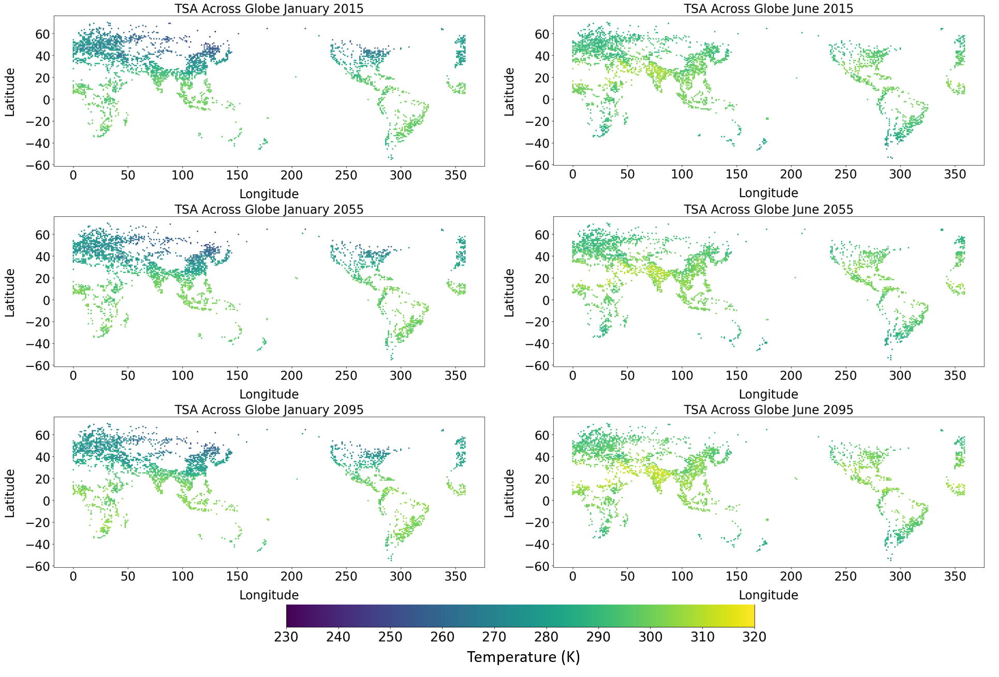

---
author-meta:
- Charlotte Cherry
- Joyce Yang
- Yiwen Zhang
bibliography:
- content/manual-references.json
date-meta: '2020-12-07'
header-includes: '<!--

  Manubot generated metadata rendered from header-includes-template.html.

  Suggest improvements at https://github.com/manubot/manubot/blob/master/manubot/process/header-includes-template.html

  -->

  <meta name="dc.format" content="text/html" />

  <meta name="dc.title" content="Machine Learning for Earth Systems Model Emulation" />

  <meta name="citation_title" content="Machine Learning for Earth Systems Model Emulation" />

  <meta property="og:title" content="Machine Learning for Earth Systems Model Emulation" />

  <meta property="twitter:title" content="Machine Learning for Earth Systems Model Emulation" />

  <meta name="dc.date" content="2020-12-07" />

  <meta name="citation_publication_date" content="2020-12-07" />

  <meta name="dc.language" content="en-US" />

  <meta name="citation_language" content="en-US" />

  <meta name="dc.relation.ispartof" content="Manubot" />

  <meta name="dc.publisher" content="Manubot" />

  <meta name="citation_journal_title" content="Manubot" />

  <meta name="citation_technical_report_institution" content="Manubot" />

  <meta name="citation_author" content="Charlotte Cherry" />

  <meta name="citation_author_institution" content="Department of Civil Engineering, University of Illinois Urbana-Champaign" />

  <meta name="citation_author" content="Joyce Yang" />

  <meta name="citation_author_institution" content="Department of Civil Engineering, University of Illinois Urbana-Champaign" />

  <meta name="citation_author" content="Yiwen Zhang" />

  <meta name="citation_author_institution" content="Department of Civil Engineering, University of Illinois Urbana-Champaign" />

  <link rel="canonical" href="https://ccherry2.github.io/earthsystemsmodel2/" />

  <meta property="og:url" content="https://ccherry2.github.io/earthsystemsmodel2/" />

  <meta property="twitter:url" content="https://ccherry2.github.io/earthsystemsmodel2/" />

  <meta name="citation_fulltext_html_url" content="https://ccherry2.github.io/earthsystemsmodel2/" />

  <meta name="citation_pdf_url" content="https://ccherry2.github.io/earthsystemsmodel2/manuscript.pdf" />

  <link rel="alternate" type="application/pdf" href="https://ccherry2.github.io/earthsystemsmodel2/manuscript.pdf" />

  <link rel="alternate" type="text/html" href="https://ccherry2.github.io/earthsystemsmodel2/v/3937f87d631f45f02f9584b18e2f891ae4a29342/" />

  <meta name="manubot_html_url_versioned" content="https://ccherry2.github.io/earthsystemsmodel2/v/3937f87d631f45f02f9584b18e2f891ae4a29342/" />

  <meta name="manubot_pdf_url_versioned" content="https://ccherry2.github.io/earthsystemsmodel2/v/3937f87d631f45f02f9584b18e2f891ae4a29342/manuscript.pdf" />

  <meta property="og:type" content="article" />

  <meta property="twitter:card" content="summary_large_image" />

  <link rel="icon" type="image/png" sizes="192x192" href="https://manubot.org/favicon-192x192.png" />

  <link rel="mask-icon" href="https://manubot.org/safari-pinned-tab.svg" color="#ad1457" />

  <meta name="theme-color" content="#ad1457" />

  <!-- end Manubot generated metadata -->'
keywords:
- Data
- Science
- Earth
- Systems
- Random
- Forest
lang: en-US
manubot-clear-requests-cache: false
manubot-output-bibliography: output/references.json
manubot-output-citekeys: output/citations.tsv
manubot-requests-cache-path: ci/cache/requests-cache
title: Machine Learning for Earth Systems Model Emulation
...

<small><em>
This manuscript
([permalink](https://ccherry2.github.io/earthsystemsmodel2/v/3937f87d631f45f02f9584b18e2f891ae4a29342/))
was automatically generated
from [ccherry2/earthsystemsmodel2@3937f87](https://github.com/ccherry2/earthsystemsmodel2/tree/3937f87d631f45f02f9584b18e2f891ae4a29342)
on December 7, 2020.
</em></small>

## Authors

+ **Charlotte Cherry** 
    · {.inline_icon}
    [ccherry2](https://github.com/ccherry2) 
  <small>
     Department of Civil Engineering, University of Illinois Urbana-Champaign
  </small>

+ **Joyce Yang** 
    · {.inline_icon}
    [joyceee916](https://github.com/joyceee916) 
  <small>
     Department of Civil Engineering, University of Illinois Urbana-Champaign
  </small>

+ **Yiwen Zhang** 
    · {.inline_icon}
    [Yiwen-Zhang97](https://github.com/Yiwen-Zhang97) 
  <small>
     Department of Civil Engineering, University of Illinois Urbana-Champaign
  </small>

## I. Abstract

Climate change is projected to impose substantial impacts and climate-driven threats to urban areas. Effective development decisions and local actions to manage these risks rely on robust climate projections that are specific to built landscapes. However, there is a near-universal lack of physical-based urban land parameterization in the state-of-the-art Earth system models (ESMs), which hinders them from making such predictions. To enable urban climate projections in ESMs, we built machine learning emulators by utilizing the Community Earth System Model (CESM) simulation results. Specifically, we chose urban 2-m temperature as our target and experimented with different sets of input variables from 485 ones present in the CESM dataset. We found that random forest emulators performed the best with other algorithms (linear regression, neural network) demonstrating high credibility as well. The root-mean-squared error (RMSE) of predictions made by random forest emulators were less than 0.2K. As few as 7 common atmospheric forcing were needed to achieve such good performance. Higher accuracy can be obtained by adding more predictors but might be affected by the absence of these predictors in other ESMs, Therefore, we should find the balance between the adaptability and accuracy of the emulator. There are other potential improvements to be made, including feature engineering, selection of structure, etc. Nevertheless, we believe that machine learning will play an increasingly important role in earth science studies.

## II. Introduction

Urban areas take up a relatively small percentage of the Earth’s land cover but have disproportionately large impacts on the climate and on humans. They are major drivers of emissions and climate change, serve as economic and social centers around the world, and house most of the human population. However, the very nature of their small physical footprint makes it challenging to study their impact on humans and the environment accurately and comprehensively.

To grapple with uncertainty and develop climate change mitigation and/or adaptation strategies, it is crucial for policymakers and planners for urban areas to understand different climate projections and scenarios, as well as urban-specific dynamics. Earth Systems Models (ESMs) are complex mathematical models that produce climate projections. They represent physical processes in the atmosphere, ocean, cryosphere, biogeochemical cycling in terrestrial and marine ecosystems, and interactions and feedbacks between these domains. These models are highly computationally demanding – taking long amounts of time and storage capacity to run over timescales of hundreds of years. This can make ESMs impractical for many uses, particularly policy analyses. Interested users may not have the capacity to utilize GCMs on a typical computer or reasonable budget. Deep learning has great potential to btter process the large amounts of data and computationally expensive nature of these models (Reichstein et al, 2019) [@Reichstein2019]. 

Currently, most state-of-the-art ESMs used today for climate change projections do not explicitly parameterize urban areas, largely due to their small area. While this does not significantly impact the quality of regular or large-scale studies, this lack of explicit parameterization limits our ability to adequately capture unique urban characteristics and dynamics. The Community Earth Systems Model (CESM) is one of the few state-of-the-art ESMs that explicitly parameterizes urban areas, with the latest version even distinguishing between three separate urban density classes. Most quantitative attributions have been typically done for non-urban surfaces, but effective development decisions and local actions to manage risks rely on robust urban climate projections. This is the motivation for us to use CESM, which has a representation of urban areas, to build a location dependent emulator, and apply it to other ESMs in order to get their urban temperature responses.

While CESM provides the advantage of explicit urban parameterization, it does still require significant supercomputing resources, which may limit its usefulness. Therefore, there is a desire to use artificial intelligence to reduce this load. A climate emulator could achieve this by statistically replicating the nonlinear behavior of ESMs more quickly and with less computing power. This project will use machine learning methods to develop a model that can emulate urban temperatures (using other atmospheric forcing variables), where the risk of heat waves in the future could have the greatest negative impacts on human health. This model will be loosely based off of the conceptual framework presented by Zhao et al (2020) - "Global multi-model projections of local urban climates" (currently in press). Urban areas in this dataset refers loosely to areas where people live (i.e., not oceans or uninhabitable areas) but they do not exclusively correspond to cities. 

## III. Methods

#### A. Exploratory Data Analysis Findings
Exploratory data analysis was performed on the training set to understand the dataset as well as the key variables included and their associated patterns. We also wanted to identify relationships among variables, which we believe will help us choose the best predictors for our model.

The training dataset contains 486 columns and 392118 rows. It includes the monthly mean of each variable from 2015 to 2100, with one year selected per decade, totaling 108 months. The longitude resolution is 288 pixels, and the latitude resolution is 192 pixels. Only the populated land area is retained. Therefore, each row represents variables in each pixel for each time step. The large number of rows indicates that we have enough samples to train the model. For columns, in addition to the target variable (urban 2-m air temperature or “TSA”) that we want to predict, we still have 485 variables that could be used as inputs to the model. Among those, some are merely descriptive information which do not provide useful clues for predicting TSA, such as current day or nstep, so they can be safely excluded.  

We wanted to further narrow down the range of variables to use as inputs, which was done by identifying the correlation between potential independent variables and the target variable. It was found that variables that were highly correlated with TSA were also temperature variables, many of which were interdependent and would not add much value to the model due to multicollinearity. Those variables are listed below.

* TSA_ICE = 2m air temperature (ice land units only)
* TBOT = atmospheric air temperature
* TG_ICE = ground temperature (ice land units only)
* TV = vegetation temperature
* TSKIN = skin temperature
* THBOT = atmospheric air potential temperature
* TG = ground temperature
* TREFMNAV = daily minimum of average 2-m temperature
* TSL = temperature of near-surface soil layer
* TSOI_10CM = soil temperature in top 10cm of soil
* TREFMXAV = daily maximum of average 2-m temperature
* TH2OSFC = surface water temperature
* TBUILD = internal urban building air temperature
* WA = water in the unconfined aquifer
* ZBOT = atmospheric reference height
* Vcmx25Z = canopy profile of vcmax25
* TOPO_COL_ICE = column-level topographic height
* ZWT_PERCH = perched water table depth  

A full list of all variables considered in the model is available in the Appendix.

Therefore, when preparing data for our model we would need to filter the predictors to only include forcing variables. We also thought that adding interaction terms between multiple variables (e.g. feature crossings of spatial and time variables such as RAIN*month) in the model would be helpful, and this might be achieved by letting the model learn the relationships by itself without manually specifying them.  

The next step was to delve into some valuable variables by visualizing them both spatially and temporally to understand the range and distribution, as well as identify anomalous values.  

#### **1. TSA**

Since TSA is our target output, we focused much of our effort on analyzing it.  

Some NAN values of TSA from 2035-08 and 2035-09 were cleaned up. Time series plots of global monthly mean temperature in urban areas showed seasonal fluctuations. The highest TSA appeared in JJA every year, which might be because there are more urban areas in the northern hemisphere where summer is in JJA. The figure below shows the high and low temperature for each year in our time series, and the flat period in between represents the years where we do not have data (we have data for 1 out of every 10 years).

 

*Figure 1: time series plot of global monthly average TSA in urban areas* 
  

 

*
Figure 1: time series plot of global monthly average TSA in urban areas
 *  
 
When these data are considered throughout the full timeline, there was an upward trend in the maximum, mean, and minimum annual temperature over the time range of projections. This climate change trend is something we would want to be able to capture in our model.

 

*
Figure 2: maximum, mean and minimum annual temperature trend
 *     
 
The standard deviation of TSA over time was also assessed, which tended to be higher in DJF than in JJA, and the magnitude did not seem to change significantly. This suggested that the underlying drivers of TSA may remain steady, even as the overall average increases.

 

*
Figure 3: time series plot of the standard deviation of global monthly average TSA in urban areas
 *     

We also examined these temperature data spatially to see how the data vary globally. As expected, the figure below shows the seasonal patterns between the northern and southern hemispheres, as well as higher temperatures near the equator. These spatial patterns of temperature in 2015, 2055 and 2095 remain similar but it is clear that warming is occurring. In particular, the Indian subcontinent appears to become warmer in the series of maps. It is also important to note that the majority of our data points are located in the northern hemisphere.

 

*
Figure 4: Maps of TSA in January and June of 2015, 2055 and 2095
 *   

#### **2. Other temperature variables** 

We examined other temperature variables that were highly correlated with TSA to verify the hypothesis of multicollinearity. Variables explored included vegetation temperature (TV), surface water temperature (TH2OSFC), internal urban building air temperature (TBUILD).

Vegetation temperature and surface water temperature had a similar spatial distribution to TSA, demonstrating high multicollinearity. The internal building air temperature had a very different spatial distribution compared to the vegetation temperature, surface water temperature, and TSA. This was likely because it is not an atmospheric variable and is probably strongly influenced by human decision-making.

*
Figure 5: Maps of TV, TH2OSFC and TBUILD in January of 2015
 *    

#### **3. Some atmospheric forcing variables**

Some atmospheric forcing variables were also worth exploring because they are inputs to every earth system model and provide a lot of information about TSA prediction, although they are not as correlated to TSA as other temperature variables. The variables chosen were according to Zhao et al (2020). The descriptions and units of these variables are listed below.

* FSDS (W/m^2): atmospheric incident solar radiation
* FLDS (W/m^2): atmospheric longwave radiation
* RAIN (mm/s): atmospheric rain, after rain/snow
* TBOT (K): atmospheric air temperature
* PBOT (Pa): atmospheric pressure at surface
* QBOT (kg/kg): atmospheric specific humidity
* U10 (m/s): 10-m wind

The correlation matrix showed that although these variables were not as highly correlated with TSA, they were still fairly correlated, especially for TBOT and FLDS.

   

*
Figure 6: correlation matrix of TSA and atmospheric forcing variables
 *  

We compared the spatial pattern of these variables to that of TSA, taking January 2015 as an example. The patterns of TBOT, FSDS, FLDS and QBOT were similar to those of TSA, whose values were larger near the equator and decreased with the increase of latitude. Other variables (RAIN, PBOT, U10) did not have clear spatial patterns, which made sense since they were not related to geospatial attributes.

*
Figure 7: Maps of TSA, TBOT, FSDS, FLDS, RAIN, PBOT, U10 and QBOT in January of 2015
 *    

Overall, we were able to gather useful information from the exploratory data analysis. The data quality was improved by identifying and removing outliers in the dataset. We learned how the temperature changed over the course of the century. We will try different combinations of variables with different algorithms to see how to achieve the best accuracy with the least amount of computing resources.

#### B. Preprocessing Data for Model

Based on the EDA, we gained some clarity about what type of preprocessing was necessary. For all of the models, NaN values for the target variable (TSA) were removed from the training set. However, the EDA also showed a set of major outliers in 2035 that were highly negative. While the initial instinct was to remove these values from the dataset, upon further inspection it was clear that these outliers were matched with outliers in other correlated temperature variables such as TG. These same patterns were observed in the independent variables of the test dataset, which implied that the same outliers likely appear in the target variable of the test set. Since all values in the test set need to be predicted, even the outliers, it is important to keep these anomalous values in the training set so that they are also reflected in the testing set. In the ideal world, all of these values would be removed from training and testing data but this is not possible since we could not edit the number of rows in the testing data used for the Kaggle competition.  

All models also included a step using sklearn’s “SimpleImputer” to fill missing values in the independent variables. The command filled missing values using the default, which is to use the mean of the column to fill the missing value. In addition, the training and testing data were normalized using the mean and standard of each of the variables.

The time variable in the original dataset is a string with all elements of the date included. For some of the models, we wanted to include time as one of the independent variables. Thus, time was converted to datetime and split into multiple columns for day, month, and year. Sine and cosine of these variables were included as variables in some models to represent the cyclical pattern where the last number of one set will be next to the first number of the next. For example, we want to represent December of one year (month 12) next to January of the next year (month 1).

Another important step that occurred in all of the models was to split the data into training and validation sets. Since the target variable values for the testing dataset are not available, this split is necessary to be able to test the accuracy of the models against a different dataset than the data used to train the model. There were two methods used for splitting the data. In some of the models, the data was split randomly. Alternatively, in some of the random forest models, a different splitting method was used. Since our data resembles a time series, although we were not using it as one, our data follows a cyclical pattern that is relatively consistent through the years. In this type of dataset, if a random set of points are used as the validation set, the pattern would still be evident. The model can easily fill in the gaps. In these cases, it is recommended to make a validation set that is a full section of the data because this will be a better test of the model’s ability to predict the target. Thus, the full data for 2085 and 2095 were used as the validation set in some cases.

#### C. Model Development

Choosing the appropriate model type is an important set in the process. Based on the dataset we have and the question we are trying to answer, the two best modeling approaches chosen by our group were Random Forests and Neural Networks because they can both be used for regressions on numerical data like the inputs we have. Our feature variables are simple numerical values and a Random Forest model can identify nonlinear relationships. However, Random Forests are bounded by the range of the highest and lowest labels in the training data. Thus, if we wanted to extrapolate the data we have into the future, this would not be a good option. In addition, Neural Networks are able to recognize patterns in the data and utilize given inputs to produce the output variable of interest. We tried both of these approaches to compare the outcomes.

##### **1. Random Forest** 

Multiple Random Forest modeling approaches were tested using different numbers of input variables and different hyperparameters to understand the effect of these changes on the accuracy of the model predictions. The models were run on the training set and tested on the validation set before finally running the testing data and comparing to the actual values through the Kaggle competition. 

For the accuracy metric, Mean Squared Error was used within the model training. However, the two metrics used for the validation set were Root Mean Squared Error and Mean Absolute Error. It is best to test multiple metrics in case there are tradeoffs between them. 

The hyperparameters were tested and tuned to find the best number of trees to include in the forest, the number of features to include in every split, the maximum number of levels, the minimum samples, and the minimum samples required in each leaf node. A random grid was created with options. Then, these parameters were searched to see if a better combination of hyperparameters was possible. Ultimately, the default hyperparameters worked well for most cases except the n_estimator value which resulted in better model outcomes when changed.

Table 1 below demonstrates the model configurations tested for Random Forest models, including the variables included, the metric, the value of the metric tested, and if any hyperparameter values were changed from the default.

*Table 1: Random Forest Model Configurations and Metrics*

| **Variables** | **Variable Count**        | **Metric**       | **Value**         | **Hyperparameters**        |
|:-----------------|:-------------:|:-------------:|:-------------:|:-------------:|
| ATM_TOPO, EFLX_LH_TOT, EFLX_LH_TOT_R, ER, ERRSEB, ERRSOL, FCEV, FCOV, FGEV, FH20SFC, FIRA, FIRA_R, FIRE, FIRE_R, FLDS, FSA, FSDS, FSDSNI, FSDSVD, FSDSVI, FSH_G, FSH_R, FSN0, FSR, FSRND, FSRNI, H20SFC, HIA, Q2M, QBOT, QICE, QIRRIG, Q0VER, QRUNOFF, RH2M, SABG, SNOWDP, TG, TH20SFC, THBOT, U10 | 41 | MAE | 0.1443  | Default |
| lat, lon, FIRE_ICE, FSA, FSDS, FLDS, HUMIDEX, PBOT, QBOT, RAIN, RH2M, SABG, SOILWATER_10CM, SWBGT, SWBGT_R, SWBGT_U, TBOT, TBUILD, TG, TG_ICE, TH2OSFC, THBOT, TOPO_COL_ICE, TREFMNAV, TREFMXAV, TSA_ICE, TSKIN, TSL, TSOI_10CM, TV, U10, Vcmx25Z, WA, ZBOT, ZWT_CH4_UNSAT, ZWT_PERCH |  36 | RMSE | 0.086 | Default |
| lat, lon, FIRE_ICE, FSA, FSDS, FLDS, HUMIDEX, PBOT, QBOT, RAIN, RH2M, SABG, SOILWATER_10CM, SWBGT, SWBGT_R, SWBGT_U, TOPO_COL_ICE, U10, Vcmx25Z, WA, ZBOT, ZWT_CH4_UNSAT, ZWT_PERCH | 23 | RMSE | 0.084 | Default |
| lat, lon, FSA, FSDS, FLDS, PBOT, QBOT, RAIN, RH2M, SABG, U10, ZWT_CH4_UNSAT, ZWT_PERCH | 13 | RMSE | 0.44 | n_estimators = 300 |
| Day sin, Year sin, Year cos, FSDS, FLDS, RAIN, TBOT, PBOT, QBOT, U10 | 10 | MAE | 0.299 | Tuned |
| FSDS, FLDS, PBOT, QBOT, RAIN, TBOT, TBUILD, THBOT, TG, U10 | 10 | RMSE | 0.1075 | Default |
| FSDS, FLDS, PBOT, QBOT, RAIN, TBOT, U10 | 7 | RMSE | 0.1837 | Default |
| FSDS, FLDS, PBOT, QBOT, RAIN, TBOT, U10 | 7 | RMSE | 0.183 | n_estimators = 300 |

We can see that the best results (RMSE = 0.084 and 0.086) occurred in the runs where more variables were used as inputs. Although there was a run that had more variables included, the results were not as good likely due to variable selection. However, the runs that gave the best results included some variables that are closely tied to temperature and may not be entirely independent. However, even when those variables were removed and the hyperparameters were tuned, the results of the model were quite good. With only 7 independent variables included, the RMSE was only 0.183 K. 

##### **2. Neural Network**

Neural Networks are more computationally demanding to run than Random Forests. So, fewer attempts were made to test different variable sets. Since all of the variables in the dataset are numerical values, no feature engineering was required. Instead, the Neural Networks were created using 4 layers with different numbers of units. All were activated using ‘relu’ and different hyperparameters were tested. The general format of the code used for the model is shown in the figure below.

   

*
Figure 8: Neural Network Model Setup
 * 

Three different variable sets were used in these Neural Networks, ranging from 23 variables to 7 variables. The configurations of the models are shown in Table 2.

*Table 2: Neural Network Model Configurations and Metrics*

| **Variables** | **Variable Count**        | **Metric**       | **Value**         |  **Layer Units** | **Hyperparameters**        |
|:-----------------|:-------------:|:-------------:|:-------------:|:-------------:|:-------------:|
|lat, lon, FIRE_ICE, FSA, FSDS, FLDS, HUMIDEX, PBOT, QBOT, RAIN, RH2M, SABG, SOILWATER_10CM, SWBGT, SWBGT_R, SWBGT_U, TOPO_COL_ICE, U10, Vcmx25Z, WA, ZBOT, ZWT_CH4_UNSAT, ZWT_PERCH| 23 | RMSE | 0.44 | 128, 64, 32, 1  | LR=1e-4, Epochs=20, Batch_size=100 |
| Day sin, Year sin, Year cos, FSDS, FLDS, RAIN, TBOT, PBOT, QBOT, U10 | 10 | MAE | 0.482 | 128, 32, 8, 1 | LR=0.1, Epochs=10, Batch_size=10 |
| FSDS, FLDS, PBOT, QBOT, RAIN, TBOT, U10 | 7 | RMSE | 0.304 | 64, 32, 16, 1 | LR=0.008, Epochs=20, Batch_size=5000 |

As these results show, the neural network actually performed better with fewer variables. The learning rate that worked best was in the middle, while even with more variables and a lower learning rate, the results were not as good. Overall, fewer units in the layers, a higher learning rate, and larger batch size performed better with only 7 variables. Even though some of the models performed better than others, the overall results show that these models fit the data pretty well with all less than 0.5 K difference from the target value, which is not a very significant difference. 

Further hyperparameter turning and changing the number of variables could produce better results. When the number of epochs was increased for the last iteration, the RMSE went as low as 0.25.

## IV. Results

### A. Overview 

Overall, the random forest models tended to do better than the neural networks that we tried. However, model performance (quantified as mean absolute error) was highly dependent on feature selection. We had to keep in mind two main goals as we developed our model. On one hand, we wanted to reduce the mean absolute error, so the model could predict urban temperature with the greatest accuracy possible. This would improve the usefulness of the model for urban planners, policymakers, and other stakeholders who could use results from this emulator. However, the main motivation behind this project was to build a model that would be easily adapted to run on other earth systems models participating in CMIP6. For this emulator to be useful for that, it would need to be easily adaptable to a wide variety of models. During model development, this manifests in decisions such as variable selection – using uncommon atmospheric variables would reduce the number of models this emulator could be used on, thus decreasing the adaptability. Considering the balance of these two goals (accuracy and adaptability), we drew from each of our individual models to synthesize the “best model.” An outline of this model will be described below. 

### B. Preprocessing

We individually arrived at many common preprocessing steps, which will be incorporated into the “best model.” We found that it was necessary to drop rows where TSA values were “NaN,” in order to build the model at all. The time was converted into datetime format and processed in some way: either making a new column for the year or converting day and year information using trigonometric functions (to better represent their cyclical nature). The training data was split into consecutive training and validation samples, without random shuffling. This improves the robustness of the model by testing it on the last time intervals of the dataset. We also found that it was important to fill in NaN values in the feature columns – if we dropped all rows with any NaN values, this would result in a greatly diminished training dataset. We found that sklearn’s “Simple Imputer” worked relatively well by replacing missing values with the mean value for each feature. Finally, we normalized the data using the mean and standard deviation of the training data, since the features had a wide range of values and magnitudes. 

Further model development could investigate the reason for these TSA = NaN values. These values could be NaN due to issues in the conversion between netcdf and csv, an issue with the original file itself, issues in the extraction of urban grid cells, a characteristic of the simulation itself, etc. Based on the reason, these rows could either be dropped, or the missing values in the training data could be imputed. 

### C. Model Development 

For our best model, we would recommend using a random forest machine learning model. Our hyperparameter tuning revealed that the number of trees (n_estimators) had the greatest impact on model error. We were able to achieve optimal results with 300 estimators. The model was not as sensitive to other hyperparameters, such as the maximum leaf nodes or minimum number of samples to split. Not bootstrapping did lead to poorer model performance. With greater computing resources, we would recommend trying a K-fold cross validation along with grid search to truly optimize hyperparameters. However, we found that most of the default hyperparameter settings worked relatively well for our model. 

In order to improve the adaptability of the model, we did not use all of the features provided, since some of those were outputs of the model (similar to TSA, and likely having the same atmospheric drivers) and others are not commonly used in other earth systems models. In order to maximize the adaptability of the model while minimizing the error, we would recommend using 7-10 common atmospheric variables as features.

### D. Future Development 

In summary, our best model was a random forest model with 300 trees. We cleaned the data by dropping TSA values that were “NaN,” converting time into datetime and extracting the year or transforming the year/month using trigonometric functions, splitting the training and validation data without shuffling (for hyperparameter tuning), filling in NaN values for the feature columns with their mean value, and normalizing the data. We found that most of the default hyperparameter settings worked well for our model, with the exception of the number of trees. Finally, we experimented with a variety of feature column combinations. In the interest of balancing the accuracy and adaptability of the model, we would recommend using some variation of these variables: lat, lon, FSDS (atmospheric incident solar radiation), FLDS (atmospheric longwave radiation), RAIN (atmospheric rain), TBOT (atmospheric air temperature), PBOT (atmospheric pressure at surface), QBOT (atmospheric specific humidity), and U10 (10-m wind), and time feature(s) (year, or trigonometric transformations of year or month, to better represent the cyclical nature of time). By preprocessing and using this model architecture, we were able to achieve a RMSE of less than 0.20 degrees Kelvin. 

Further development of this model could focus on feature processing/extraction, or general model architecture improvements. It would be interesting to incorporate more spatially explicit features, such as distance to coast, climate zone, etc. Lat/lon information could also be an important predictive feature with further manipulation, such as binning. We would recommend trying different methods of imputing NaN values, which could vary by the reason for the NaN values, and vary by the feature. Different selections and combinations of features could also be explored. After adjusting feature processing/extraction, model architecture and hyperparameters could be further developed and tested. While there is room for further model improvement, our combined findings and recommended model provide a strong starting point for future work. 

## V. Discussion and Conclusion

### A. Interpreting Results

The usefulness of this model and the level of accuracy that an RMSE of 0.20K represents depends on the desired application. For decision-making purposes, a RMSE of 0.20K is much lower than the uncertainty of future emissions, climate forcing/dynamics, and model structural uncertainty. For stakeholders/policymakers, this model would be most useful for predicting general patterns in urban temperature (both spatially and temporally), rather than for exact quantities. Additionally, it would be very useful in creating large ensemble projections of urban temperature under future climate change. 

### B. What We Learned

#### **1. Importance of Variable Selection** 

As we saw from the EDA, there are many variables with multicollinearity. When the correlations were examined, some of the variables were very highly correlated, such as TG or TSKIN. However, it’s important for us to recognize which of these would actually be significant variables to include in the model. While it was tempting to use these to make a model that would have high predictive capability, this would not be valuable from an emulator perspective, and it might give us false confidence in our model. Instead, we needed to identify variables that were likely correlated or had driving capability of TSA but that were truly independent. In addition, we wanted to select variables that could be found in other models so that this approach might be scaled or informative to practical applications.
We learned through this process that the choice of variables used as the independent input or feature variables is very important. Our approaches ranged from using only seven common atmospheric variables to using over 40 of the columns as feature variables. On one hand, we demonstrated that there are numerous variables that should not be chosen as the input variables because of their close link to the target variable. We expected that including these variables would make it too easy for the model to accurately predict the target. When tried, it is true that including some of these closely linked variables resulted in the best results for the random forest model. However, surprisingly, in some of the model runs, having more variables did not necessarily mean that the model would perform better. For example, the Random Forest model that included the 41 variables performed worse than a model with 10 variables. And, the Neural Network model with the least variables performed best. In

#### **2. Difficulties of Operating on Large Data**

Throughout the modeling process, we faced numerous challenges due to the large size of our input dataset. Opening the files as dataframes or making edits to them was arduous. In addition, it made running the neural network very cumbersome, particularly when the number of feature variables was high. Kaggle often ran out of memory or processing space or the platform would crash before making it through the model, which meant the necessary inputs were lost. These challenges presented limitations on the amount of trials that we could run and it also made it more difficult to run different hyperparameter permutations to improve model tuning.

Future research in this area would likely require greater computing power. While it is still less computationally demanding that the earth systems models themselves, even the files required to run these models are very large and taxing on computer memory when using open-source tools not capable of this level of computing. Therefore, we could probably have achieved better results using additional storage and computing to find even more closely tuned parameters and compare the various model runs more easily.

### C. Use of Machine Learning for Earth Systems Model Emulation

Generally, all the emulators have shown great power in achieving our goal of predicting urban temperatures from earth system models with less computing resources needed. Even the simplest linear regression models showed high accuracy. Nevertheless, we were still able to further boost the performance with a highly credible random forest emulator whose root-mean-squared error was significantly smaller than the urban temperature differences between CESM member runs (~1.5K). As few as 7 variables were needed as inputs to the model. The training time was short, and the fitting time was within a few seconds, which may save decision makers much time in obtaining predictions. This indicates the important role of statistical methods in climate-related research.

In fact, other studies have also proposed statistical approaches that took a small set of precomputed runs of global climate models to build an emulator which produced climate outputs. [@Castruccio2014] They demonstrated that this was a computationally efficient way of climate modeling, and it outperformed the traditional pattern downscaling method that tried to achieve the same results. This study showed that even a relatively simple statistical method could capture the temporal dynamics in climate modeling and was quite credible in applications such as impact assessment and others that did not necessarily depend on extremely accurate predictions. The limitation was that they only assumed a linear relationship between the input and output. In our study, we were able to use the random forest model which learned to capture more complex relationships by itself rather than us having to specify them manually.

However, we should still point out that even though we were able to obtain a very small RMSE with more variables added, some of those variables might not be present in other earth system models. We need to avoid selecting such ones for adaptability to other models. In addition, since all of our data comes from the same earth system model (CESM), it is not clear if the emulator fit by this particular dataset will handle data from other models well. More extreme values of some variables may appear, which may not be well fit in random forest emulators. Fortunately, unlike ESMs, there is not much internal dynamics in urban parameterizations, which suggests predictions will not drift too far apart with the same set of input variables applied. [@Grimmond2011] Other potential problems include the absence of urbanization trend in the emulator that will certainly influence the accuracy of urban temperature prediction. This cannot be solved by emulator improvement, but only by better urban parameterizations.

Just like Reichstein et al suggested, future studies in earth science offers many opportunities to use machine learning and deep learning approaches to develop data-driven models that can leverage data sources more effectively and provide insights. Physically-guided emulators have a strong capability in this sense, although with many possible improvements to be made. [@Reichstein2019]

## References {.page_break_before}

<!-- Explicitly insert bibliography here -->

[@Castruccio2014]: doi:10.1175/JCLI-D-13-00099.1

[@Grimmond2011]: doi:10.1002/joc.2227

[@Reichstein2019]: doi:10.1038/s41586-019-0912-1

## Appendix: Variable Definitions

This table includes the full list of variables used in the models created and their definitions and units.

*Table A: Variable Names and Definitions*
  

| *Variable* | Unit          | Meaning          |
|:-----------------|:-------------:|:-------------:|
| *TSA* | *K* | *2m air temperature (target variable)* |
| ATM_TOPO |  m | Atmospheric surface height | 
| Day sin | day | Sine of day term |
| EFLX_LH_TOT | W/m^2 |Total latent heat flux (+ to atm)  |
| EFLX_LH_TOT_R | W/m^2 | Rural total evaporation |
| ER | gC/m^2/s | Total ecosystem respiration, autotrophic + heterotrophic |
| ERRSEB | W/m^2 | Surface energy conservation error |
| ERRSOL | W/m^2 | Solar radiation conservation error |
| FCEV | W/m^2 | Canopy evaporation |
| FCOV | unitless | Fractional impermeable area |
| FGEV | W/m^2 | Ground evaporation |
| FH20SFC | unitless | Fraction of ground cover by surface water |
| FIRA | W/m^2 | Net infrared (longwave) radiation |
| FIRA_R | W/m^2 | Rural net infrared (longwave) radiation |
| FIRE |W/m^2  | Emitted infrared (longwave) radiation |
| FIRE_ICE | W/m^2 | Emitted infrared (longwave) radiation (ice landunits only) |
| FIRE_R | W/m^2 | Rural emitted infrared (longwave) radiation |
| FLDS | W/m^2 | Atmospheric longwave radiation |
| FSA | W/m^2 | Absorbed solar radiation |
| FSDS | W/m^2 | Atmospheric incident solar radiation |
| FSDSNI | W/m^2 | Diffuse nir incident solar radiation |
| FSDSVD | W/m^2 | Direct vis incident solar radiation |
| FSDSVI | W/m^2 | Diffuse vis incident solar radiation |
| FSH_G | W/m^2 | Sensible heat from ground |
| FSH_R | W/m^2 | Rural sensible heat |
| FSN0 | unitless | Fraction of ground covered by snow |
| FSR | W/m^2 | Reflected solar radiation |
| FSRND | W/m^2 | Direct nir reflected solar radiation |
| FSRNI | W/m^2 | Diffuse nir reflected solar radiation |
| H20SFC | mm | Surface water depth |
| HIA | C | 2m NWS Heat Index |
| HUMIDEX | C | 2m Humidex |
| lat | degrees_north | Coordinate latitude |
| long | degrees_east | Coordinate longitude |
| PBOT | Pa | Atmospheric pressure at surface |
| Q0VER | mm/s | Surface runoff |
| Q2M | kg/kg | 2m specific humidity |
| QBOT | kg/kg | Atmospheric specific humidity |
| QICE | mm/s | Ice growth/melt |
| QIRRIG | mm/s | Water added through irrigation |
| QRUNOFF | mm/s | Total liquid runoff not including correction for land use change |
| RAIN | mm/s | Atmospheric rain, after rain/snow |
| RH2M | % | 2m relative humidity |
| SABG | W/m^2 | Solar rad absorbed by ground |
| SNOWDP | m | Gridcell mean snow height |
| SOILWATER_10CM | kg/m2 | Soil liquid water + ice in top 10cm of soil |
| SWBGT | C | 2m Simplified Wetbulb Globe Temp |
| SWBGT_R | C | Rural 2m Simplified Wetbulb Globe Temp |
| SWBGT_U | C | Urban 2m Simplified Wetbulb Globe Temp |
| TBOT | K | Atmospheric air temperature |
| TBUILD | K | Internal urban building air temperature |
| TG | K | Ground temperature |
| TG_ICE | K | Ground temperature (ice landunits only) |
| TH20SFC | K | Surface water temperature |
| THBOT | K | Atmospheric air potential temperature |
| TOPO_COL_ICE | m | Column-level topographic height |
| TREFMNAV | K | Daily minimum of average 2m temperature |
| TREFMXAV | K | Daily maximum of average 2m temperature |
| TSA_ICE | K | 2m air temperature (ice landunits only) |
| TSKIN | K | Skin temperature |
| TSL | K | Temperature of near-surface soil layer |
| TSOI_10CM | K | Soil temperature in top 10cm of soil |

